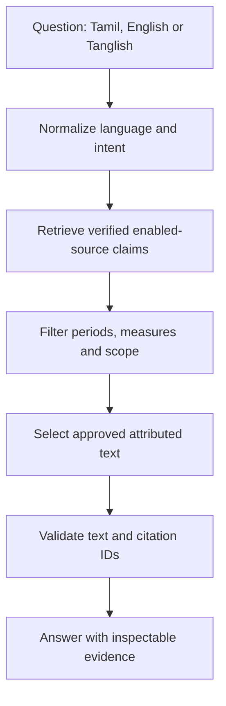

# Tamil Nadu Governance AI
## தமிழ்நாடு ஆட்சி தகவல் AI

An evidence-first public knowledge assistant covering the documented first 2021–2026 term led by M.K. Stalin. This is an independent information product, not an official government service or political campaign.

## Current delivery and verified limits

This repository contains a runnable Next.js application and the Phase 1 foundation, claim-centric database architecture, conservative retrieval/answer pipeline, and an initial admin evidence workflow. It is **not a claim that the entire production acceptance checklist has been validated**.

Without credentials, the public app works against a small bundled, source-checked demonstration dataset. Supabase mode uses the configured database exclusively: it does not silently fall back to demo facts on database failure. No invented beneficiary, employment, budget or outcome values are seeded.

The admin workflow is implemented but requires a configured Supabase project. SQL migrations, RLS, Auth, Storage and the optional external AI provider were not exercised against live services in this delivery. The browser runtime was unavailable, so visual/mobile and screen-reader QA remain outstanding. Most main navigation, question flows, and evidence answers are bilingual; some detailed public explanatory text and admin labels remain English and need editorial Tamil translation before a full bilingual release.

## What is built

- Responsive homepage with a large question box and suggested questions.
- `/ask`: Tamil, English and Tanglish questions; tab-local history; source inspection; verification; copy; feedback; database-backed sharing.
- `/schemes` and `/schemes/naan-mudhalvan`: documented scheme records, filters, factual evidence and explicit gaps.
- `/timeline`: source-supported launches and empty years.
- `/data`: filters, exact tables, and comparable-measure bar charts when approved quantitative records exist; no fabricated chart or zero-filled map.
- `/departments`, `/sources`, `/search`, `/about`.
- `/answer/[id]`: dated, public evidence snapshot; always warns that the snapshot may be outdated.
- `/admin`, `/admin/uploads`, `/admin/verification`, `/admin/sources`, `/admin/schemes`: password sign-in with server-side allowlist authorization; file/text extraction; source configuration; draft scheme creation; attributed claim review with translations and quantitative fields; approve/reject/investigate.
- PDF/DOCX/TXT ingestion, private original file storage, page-aware PDF extraction, overlapping chunks, unverified sentence candidates and atomic claim publication.
- SQL constraints, RLS policies, private evidence bucket, audit triggers, claim history, verification records, hybrid full-text/vector search.
- Provider abstraction, exact approved-text validation and safe extractive fallback.

## File structure

```text
app/
  page.tsx, layout.tsx, globals.css
  [section]/page.tsx
  schemes/[slug]/page.tsx
  answer/[id]/page.tsx
  admin/, admin/[section]/
  api/ask/, api/admin/, api/feedback/, api/answers/
components/
  workspace.tsx, admin-console.tsx
  evidence-dialog.tsx, data-explorer.tsx, language-provider.tsx
lib/
  types.ts
  ai/provider.ts
  db/client.ts, browser.ts, repository.ts, seed-data.ts
  rag/engine.ts, normalization.ts, retrieve.ts
  security/auth.ts, ingestion.ts, rate-limit.ts
supabase/
  config.toml
  migrations/001_evidence.sql
  migrations/002_atomic_review.sql
scripts/seed.ts, evaluate.ts, smoke.mjs
tests/evidence.test.ts, integration/rls.sql
.env.example
```

## Local setup

Use Node.js 24 LTS (the tested runtime) and npm.

```bash
npm ci
cp .env.example .env.local
npm run dev
```

Open `http://localhost:3000`. With blank Supabase values the public app runs in demonstration mode. Admin, persistent feedback and sharing truthfully report that database configuration is required. `AI_PROVIDER=extractive` requires no API key.

```bash
npm run typecheck
npm run lint
npm run test
npm run evaluate
npm run build
npm start
```

`node scripts/smoke.mjs` starts a temporary server on port 3100 and checks public routes, English/Tamil/unsupported-answer APIs and anonymous admin denial. Stop any existing dev server in this checkout first, since Next.js uses a single checkout lock.

## Environment variables

| Variable | Purpose |
| --- | --- |
| `NEXT_PUBLIC_SUPABASE_URL` | Project URL |
| `NEXT_PUBLIC_SUPABASE_ANON_KEY` | Browser public API key, protected by RLS |
| `SUPABASE_SERVICE_ROLE_KEY` | Server-only key; never copy into a public-prefixed variable |
| `AI_PROVIDER` | `extractive` or `openai-compatible` |
| `AI_API_KEY` | Server-only optional AI provider key |
| `AI_MODEL` | Chat model for evidence selection |
| `AI_BASE_URL` | HTTPS OpenAI-compatible endpoint; default `https://api.openai.com/v1` |
| `AI_EMBEDDING_MODEL` | Embedding model; default `text-embedding-3-small`, must support 1536 dimensions |
| `APP_URL` | Trusted origin, e.g. `http://localhost:3000` or production URL |
| `UPSTASH_REDIS_REST_URL` | Production shared rate-limit storage |
| `UPSTASH_REDIS_REST_TOKEN` | Server-only rate-limit credential |

In production with a configured database, public write/question endpoints fail closed without a shared rate limiter. Development/demo mode uses a process-local limiter; this is not a distributed production substitute.

## Supabase and pgvector setup

1. Create a Supabase project. Disable public sign-up in Auth settings; provision administrator accounts through the dashboard or Admin API.
2. Set the three Supabase environment values in `.env.local`.
3. Apply `001_evidence.sql`, then `002_atomic_review.sql`, using the Supabase SQL editor or CLI migrations. `001` enables `vector` in `extensions`, creates all tables/indexes/RLS policies and the private `evidence` Storage bucket.
4. Run `npm run seed`. This is an explicit administrative seed operation, not automatic crawling.
5. Inspect the source document, translations and seed records yourself before launch. Record any editorial corrections through the review workflow.
6. Configure a distributed rate limiter before public production use.

CLI alternative: link your Supabase project and run `supabase db push`. `supabase/config.toml` disables public signup for local CLI deployments; apply the same setting explicitly to a hosted project.

### Migrations

`001_evidence.sql` creates `schemes`, `departments`, `categories`, `districts`, `scheme_districts`, `documents`, `document_chunks`, `claims`, `claim_sources`, `claim_versions`, `statistics`, `budgets`, `beneficiaries`, `outcomes`, `timeline_events`, `citations`, `verification_records`, `source_domains`, `admin_users`, `chat_sessions`, `chat_messages`, `answer_snapshots`, `feedback`, and `audit_logs`.

It includes full-text and HNSW vector indexes, verification constraints, source-domain checks, version history and private storage policies. `002_atomic_review.sql` adds a service-role-only transactional review RPC. Publication of the document, claim and scheme occurs in one transaction; a failed constraint rolls back the publication.

Public RLS reads are limited to published records; admin writes require `is_admin()`. Anonymous clients cannot write directly to claims or sources or read private chat, feedback, audit or original-file storage. Server routes using the service role independently enforce authorization and published/source-enabled status. Raw document text and embeddings are never passed to public client components.

## Administrator creation

Create a password user in Supabase Auth. Copy that user's UUID and run, as the project administrator:

```sql
insert into public.admin_users(id, enabled)
values ('REPLACE_WITH_AUTH_USER_UUID', true);
```

Then sign in at `/admin`. An ordinary Auth account without an enabled `admin_users` row cannot use the console APIs. Session tokens are kept in memory, not localStorage. Reloading the console requires signing in again. No passwords or bootstrap accounts are hardcoded.

## Initial scheme and sources

The bundled seed includes one scheme, five attributed claims and one Level A document:

- Scheme: Naan Mudhalvan / நான் முதல்வன்.
- Original document: [TNSDC EOI, 7 March 2026](https://portal.naanmudhalvan.tn.gov.in/pdfs/EOI/2026-27_odd_iti.pdf), page 2.
- Claims cover launch on 1 March 2022, industry-relevant skills/job-readiness objectives, soft-skill course areas, free emerging-technology courses, and career/academic counselling.
- Verification/source check: 1 October 2026; programme descriptions preserve the 7 March 2026 publication context.
- The source is an official programme description, **not an independent outcome evaluation**.
- No quantitative achieved outcome, actual expenditure, beneficiary total or employment number is seeded. The source's numerical objective is intentionally not treated as an achieved figure.

The seed whitelist permits the exact official document host `portal.naanmudhalvan.tn.gov.in`. Add other official/institutional domains deliberately through `/admin/sources`; subdomains are not automatically trusted. Disabling a source removes its claims from current retrieval.

## Adding evidence and the first new verified scheme

1. Create a draft scheme with reviewed Tamil/English text in `/admin/schemes`.
2. Add an exact source domain, organization, category and A/B/C/D level.
3. Upload a text-based PDF, DOCX or TXT, or paste source text in `/admin/uploads`; include the original HTTPS URL, date and scheme. Files are private, server-named and limited to 10 MB.
4. The pipeline extracts text and chunks and creates **unverified sentence candidates**, not automatically verified AI claims. Source URLs are recorded; arbitrary URLs are not fetched or crawled.
5. Review a candidate in `/admin/verification`. Rewrite it as an attributed atomic claim, add a reviewed Tamil translation, verify the exact supporting excerpt and page, choose the semantic type, and record a reason.
6. For numeric claims require metric, value, unit, reporting period, geography, population scope and source page. Use separate claims for each year and measure. Do not put training and employment in the same metric.
7. Approve only after checking the original. The RPC records review/history and publishes the approved claim; configured embeddings are created on approval. It then becomes searchable.
8. Corrections preserve prior versions and a reviewer reason. Do not overwrite an old-year observation with a new-year value.

Scanned PDFs require OCR externally before upload. DOCX has no stable rendered page number: a numeric claim needs the reviewer to establish the supporting page in an authoritative paginated source. Extraction is synchronous and intended for small initial documents; background ingestion, OCR and large-document queues are future production work.

## Retrieval and RAG



Demo mode uses a deterministic scheme alias/intent retriever. Database mode normalizes query tokens, combines PostgreSQL full-text matches (including scheme names) with pgvector similarity, and reranks by returned score after metadata/semantic filtering. Only a bounded candidate set is sent to the model. It does not send the entire database.

With `AI_PROVIDER=openai-compatible`, the provider embeds questions and approved claims and selects approved answer sentences at temperature 0. If embedding generation fails, keyword retrieval remains available. If model selection fails, the engine falls back to approved text, not unsupported model knowledge.

The current vector similarity cutoff is a conservative engineering heuristic, **not a confidence percentage or an empirically calibrated accuracy guarantee**. The current reranker is score/metadata-based, not a cross-encoder. Broader multilingual retrieval needs evaluation against a real reviewed corpus before release.

## Citation and claim validation

A generated selection is accepted only when its ID belongs to the retrieved verified evidence and its text exactly matches the reviewed English or Tamil claim. Unknown IDs, wrong-text citations and unsupported paraphrases are discarded. This deliberately sacrifices free-form prose for factual reliability.

The verification drawer displays each claim's document, organization, source level/category, publication date, page, excerpt, reporting context, version and verification date. Exact excerpts are highlighted; the original PDF opens at the page anchor. Claim verification is a human editorial decision, not an automated proof that a statistic is true.

Same-metric, same-period, same-unit, same-population and same-geography conflicting figures are displayed separately. Different periods remain separate observations. No figures are summed automatically. Confidence labels describe source coverage; they do not invent probabilities.

Unsupported questions return the required Tamil/English insufficient-evidence message. Requests for voting advice or party ranking are declined. Document instructions remain data; they never become system instructions.

## Testing and evaluation

- `tests/evidence.test.ts`: unsupported claims, wrong citations, Tamil/Tanglish, source whitelist, missing admin authentication, injection separation, temporal conflicts and semantic distinctions.
- `scripts/evaluate.ts`: expected evidence IDs for seven initial questions, including unsupported employment/training counts.
- `scripts/smoke.mjs`: actual Next.js routes and APIs.
- `tests/integration/rls.sql`: a disposable-project RLS test script. **Not executed without a Supabase environment**.

For live RLS verification, execute the integration SQL in a disposable migrated/seeded Supabase project, and add tests for authenticated non-admin versus admin roles, Storage policies and RPC authorization. Verify that anonymous users can read only safe published columns and cannot bypass the server's approval path.

## Vercel deployment

1. Commit this repository to GitHub; import it into Vercel as a Next.js project.
2. Use Node.js 24 LTS. Build command: `npm run build`. Leave Output Directory at the Next.js framework default; do not set a custom output directory.
3. Configure all production environment variables. Set `APP_URL` to the actual deployment origin. Keep service role, AI key and Redis token server-only.
4. Apply Supabase migrations and seed/review the sources separately; Vercel builds intentionally do not run database migrations.
5. Disable Supabase public signup, provision the first admin and configure Redis rate limiting.
6. Deploy, then verify public questions, citation inspection, live sign-in, upload/review/publish, corrections, sharing and RLS on the deployed origin.

No Vercel deployment was performed by this delivery.

## Security and remaining work

Before calling this production-ready, complete:

- Apply and test migrations, RLS, Auth, Storage, review transactions and provider integration against real credentials.
- Visual/mobile/browser and assistive-technology QA; validate WCAG AA contrast and keyboard use at 200% zoom. Evidence drawer includes focus trapping/return and Escape dismissal, but compliance is not certified.
- Complete editorial Tamil translations for every public helper label, empty state and detailed explanation; administrator UX currently uses English.
- Background ingestion/embedding jobs, retry/idempotency controls, OCR and DOCX decompression/resource isolation for larger inputs; current candidate extraction is deterministic sentence splitting, not AI structured extraction.
- Edit/archive full scheme forms, district association editing, source editing/removal controls, comprehensive statistics/budget/outcome record management and general timeline-event editing. Current public timeline derives scheme launch records.
- Persistent conversation sessions beyond tab-local history; privacy/retention jobs. The schema supports sessions/messages but the current chat does not persist them.
- Universal database search across every entity (current search page searches loaded public records); robust multilingual normalizers, contextual scheme resolution and a larger adversarial evaluation corpus.
- Independent outcome studies and verified year/district datasets. Add line charts/maps only when meaningful compatible data exists; do not manufacture coverage.
- Production observability, backups/restore drills, session expiry handling, upload quotas and rate-limit operational monitoring.

Accuracy is more important than filling every view. The current empty states intentionally expose those evidence gaps.
